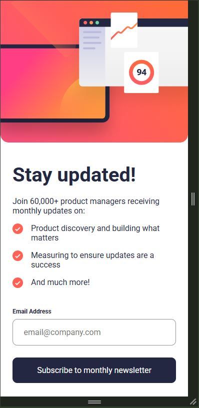
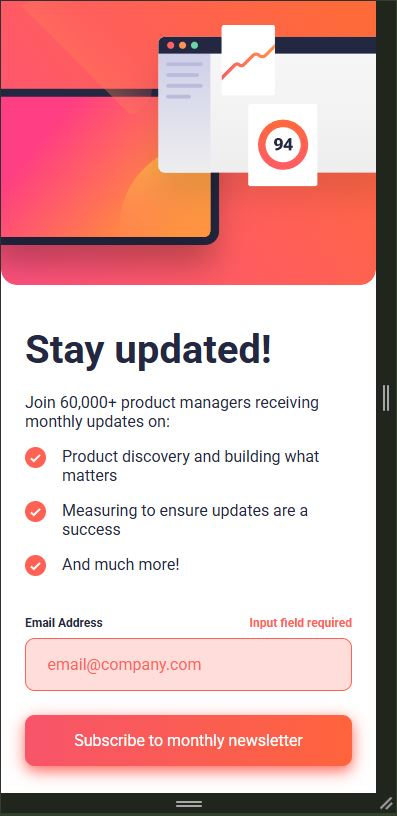
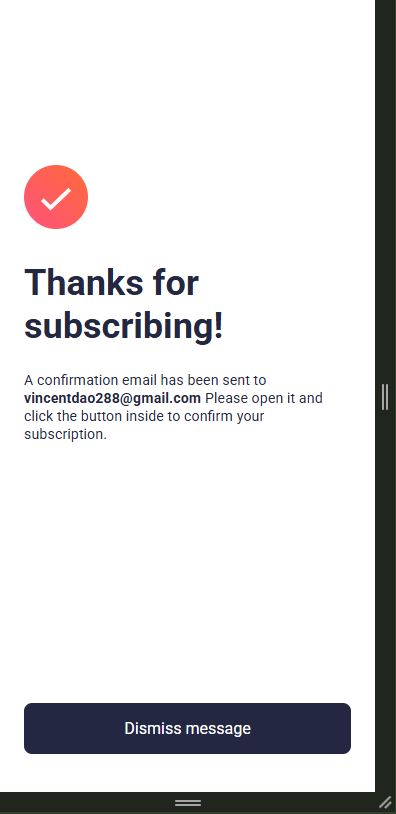
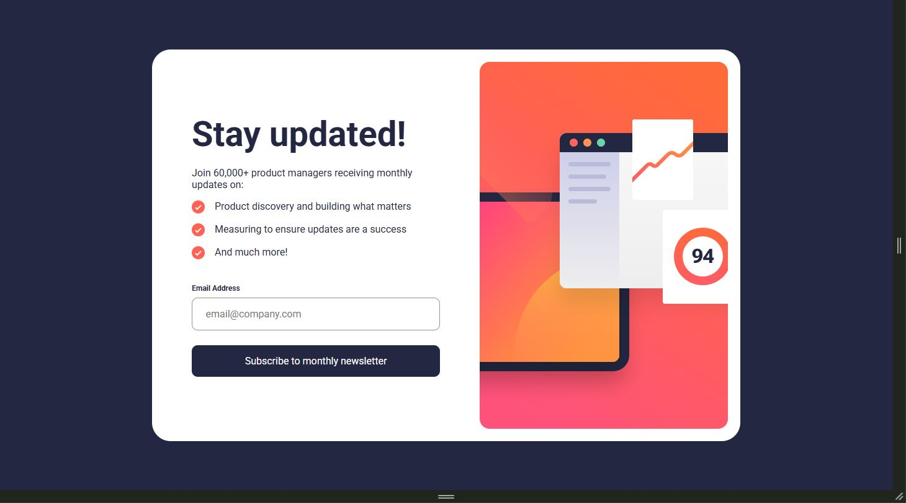
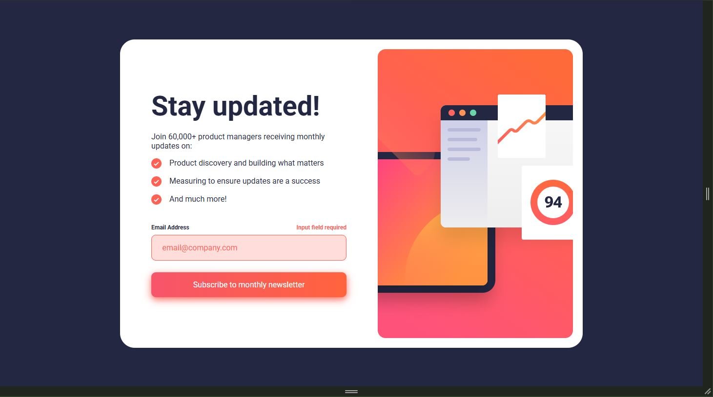
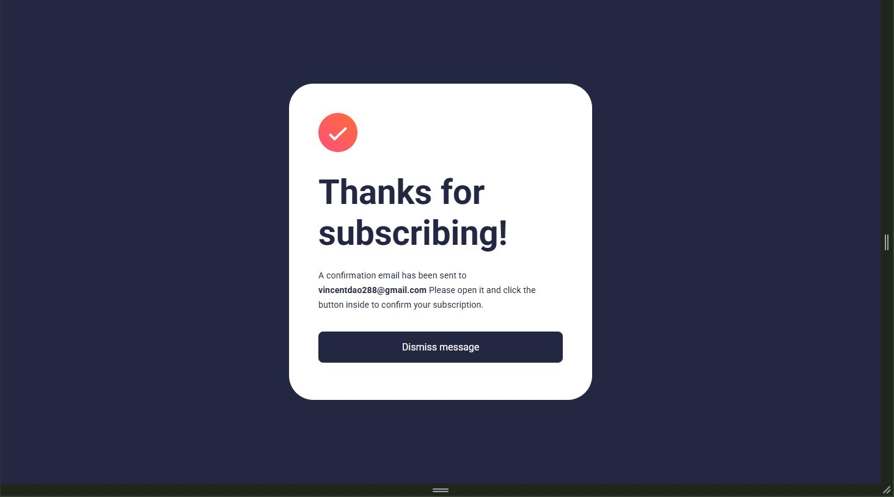

# Newsletter sign-up form with success message solution

This is a solution to the [Newsletter sign-up form with success message challenge on Frontend Mentor](https://www.frontendmentor.io/challenges/newsletter-signup-form-with-success-message-3FC1AZbNrv).

## Table of contents

- [Overview](#overview)
  - [The challenge](#the-challenge)
  - [Screenshot](#screenshot)
  - [Links](#links)
- [My process](#my-process)
  - [Built with](#built-with)
  - [What I learned](#what-i-learned)
  - [Continued development](#continued-development)
  - [Useful resources](#useful-resources)
- [Author](#author)
- [Acknowledgments](#acknowledgments)

## Overview

The goal was to build out a newsletter form and get it looking as close to the design as possible while ensuring proper input validation and web responsiveness.

### The Challenge

Users should be able to:

- Add their email and submit the form
- See a success message with their email after successfully submitting the form
- See form validation messages if:
  - The field is left empty
  - The email address is not formatted correctly
- View the optimal layout for the interface depending on their device's screen size
- See hover and focus states for all interactive elements on the page

### Screenshot








### Links

- Solution URL: [GitHub Repository](https://github.com/Squ1nty/Newsletter-SignUp-Form)
- Live Site URL: [Live Site](https://your-live-site-url.com)

## My process

### Built with

- Semantic HTML5 markup
- CSS custom properties (Media Queries, -Webkit-)
- Flexbox
- CSS Grid
- JavaScript
- Mobile-first workflow

### What I learned

I encountered many challenges in this challenge actually. First, I had to deal with -webkit- issues that kept overriding my CSS, which I eventually learnt (through a good hour of reading) how to fix.

Regarding JS, I also encountered an issue with using the validity() method, only to realise I was missing the validityCheck() method call prior to using any other valid() methods. All issues were overcome through reading and learning of new materials.

Code Snippets I am most proud of:
```html
<svg xmlns="http://www.w3.org/2000/svg" width="21" height="21" viewBox="0 0 21 21" alt="customTickDotPoint"><g fill="none"><circle cx="10.5" cy="10.5" r="10.5" fill="#FF6155"/><path stroke="#FFF" stroke-width="2" d="M6 11.381 8.735 14 15 8"/></g></svg>
```
```css
.error-State #emailInput:invalid:-webkit-autofill{
  -webkit-box-shadow: 0 0 0 1000px hsl(3, 100%, 93%) inset !important;
}
```
```js
form.addEventListener("submit", (e) =>{
  e.preventDefault();

  errorMsg.textContent = "";

  if(!emailInput.checkValidity()){
    if(emailInput.validity.typeMismatch){
      errorMsg.textContent = "Valid email required";
    }
    else if(emailInput.validity.valueMissing){
      errorMsg.textContent = "Input field required";
    }
    form.classList.add("error-State");
    return;
  }

  userEmailConfirmation.textContent = emailInput.value;
  mainLoginPage.classList.toggle("active");
  successPage.classList.toggle("active");
});
```

### Continued development

Next time, I would continue to work on developing my CSS responsiveness skills to better build my website without having to go back and forth fixing formatting issues at the end. Outside of this, I will continue to master my HTML, CSS and JavaScript skills as a whole; learning more advanced concepts as I progress.

### Useful resources

- [MDN WebDocs Client-Side Form Validation](https://developer.mozilla.org/en-US/docs/Learn_web_development/Extensions/Forms/Form_validation) - This page really helped me in providing a step by step resource to gradually learn the ins-and-outs of form validation. In future, I will definitely continue to use MDN WebDocs as a guide thanks to their simple to understand yet extensive database of information.
- Outside of this website, with obvious help from quick google searches, countless hours on stackOverflow and other threads, I was able to learn and discover new techniques to solve this challenge.

## Author

- GitHub - [@Squ1nty](https://github.com/Squ1nty)
- Frontend Mentor - [@Squ1nty](https://www.frontendmentor.io/profile/Squ1nty)

## Acknowledgments

I wanted to thank all those who provided me helpful advice in my previous projects, as I believe I was better able to adhere to industry standards and workflows this time around as compared to older projects. Examples of growth include: usage of alt and aria-label attributes in HTML, proficient use of media queries when styling for a mobile-first approach and being able to create a efficient and elegant JavaScript implementation to provide itneractivity for the form.
